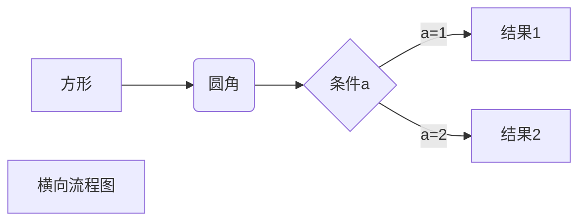
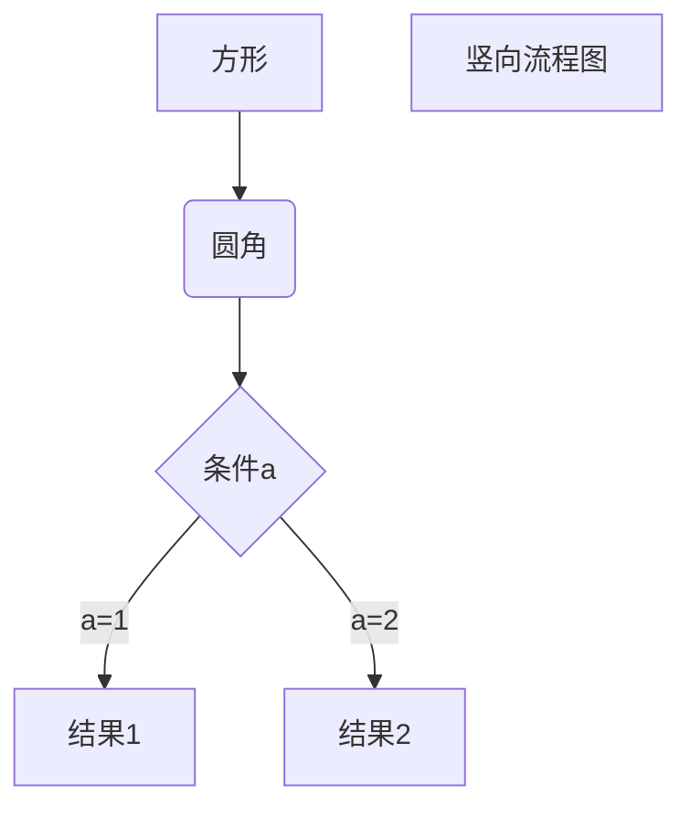
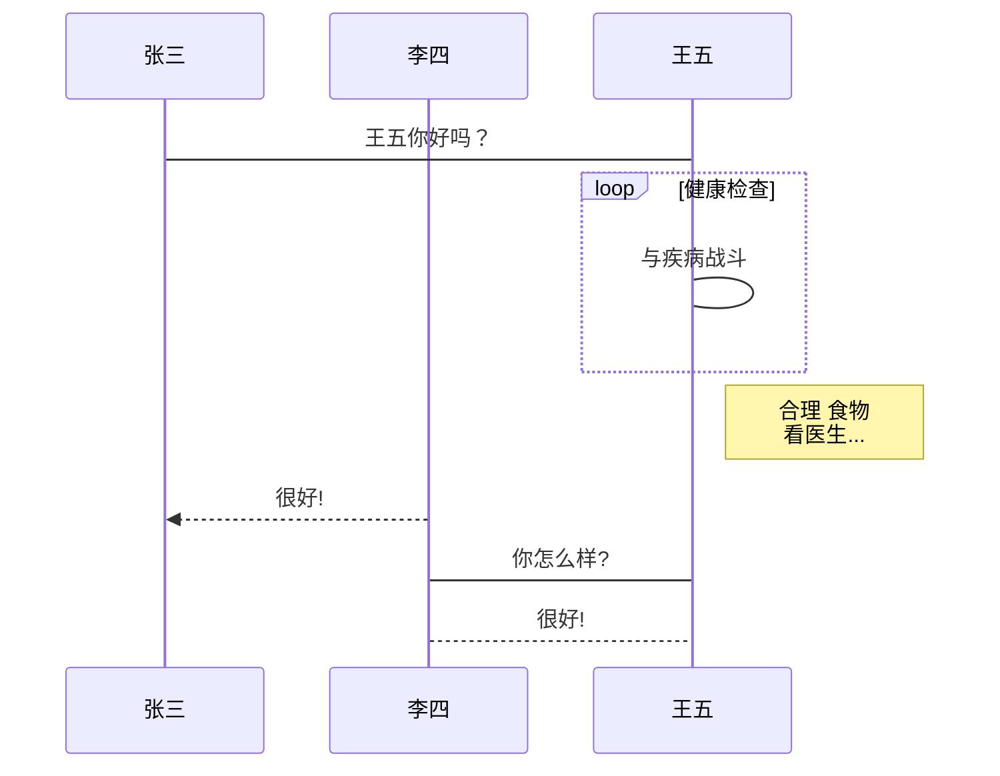
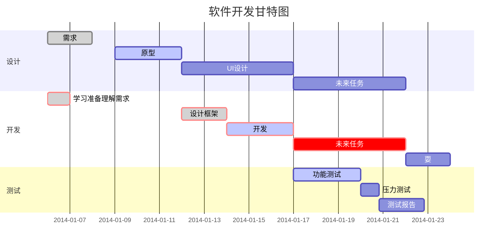

# demo

## 目录（TOC）

[TOC]

## Images

### 行内式


### 标签式


### 参数式

参数格式图片：[图片][image]

[image]: https://ss1.bdstatic.com/70cFuXSh_Q1YnxGkpoWK1HF6hhy/it/u=1089874897,1268118658&fm=26gp=0.jpg

### 视频

<video src="https://firstsite.oss-cn-shanghai.aliyuncs.com/test/video/test.mp4?Expires=1608172988&OSSAccessKeyId=TMP.3Kf1YQa77gzFPTjCEPXj3ixiLQd8RuR3VUkCtWtFw17HMazy2L47CigsrMK3UNphUzLHGZiGqi4eWXY2eg22QMguTvNpr4&Signature=7BoUzsV%2F%2B%2FffjBw2ml%2BUdYJdwEs%3D" />

## Lists

### 无序列表

* 第一项
    > dsadsadad
* 第二项

+ 第三项
+ 第二项

- 第一项
- 第二项
    > afasfaf

### 有序列表

1. aaaaa
   > 列表中的区块
2. bbbb
3. c c c c

### 列表嵌套

1. 第一项
    - 第一项嵌套的第一个元素
    - 第一项嵌套的第二个元素
2. 第二项
    - 第二项嵌套的第一个元素
    - 第二项嵌套的第二个元素

## Headers

## 区块

> 区块引用
> 菜鸟教程
> 学的不仅是技术更是梦想

> 最外层
> > 第一层嵌套
> >
> > > 第二层嵌套

> 区块中使用列表
> 1. 第一项
> 2. 第二项
> + 第一项
> + 第二项
> + 第三项

## 链接

### 行内式1

  这是[百度](https://www.baidu.com "title属性")的链接

### 参数式1

这是[百度][1]和[新浪][2]的链接

[1]: https://www.baidu.com "title属性"
[2]: https://www.sina.com "title属性"

## Code Fences

### 单行代码框

  `<p>大叔大叔大叔</p>`

### 多行代码框

```html
  <p>大叔大叔大叔</p>
  <p>大叔大叔大叔</p>
  <p>大叔大叔大叔</p>
```

```shell
    echo "hello world!"
```

```javascript
    let name = 'phoenix'
    function print_str(str) {
    console.log(str)
    }
```

```python
    import numpy
    print("numpy's attr:   {}".format(dir(numpy)))
```

```java
    class Person {
        private age;
        public name;

        public void getAge(){
            return this.age;
        }
        public void setAge(age) {
            this.age = age;
        }
    }
```

### 强调

*字体倾斜*
_字体倾斜_
**字体加粗**
__字体加粗__
*斜体*或_斜体_
**粗体**
***加粗斜体***
~~删除线~~
<u>下划线</u>
==字体高亮==
H~2~O
y = x^2^
:smile:
:smiley:
:angry:
<font face="黑体">我是黑体字</font>
<font face="微软雅黑">我是微软雅黑</font>
<font face="STCAIYUN">我是华文彩云</font>
<font color=#0099ff size=12 face="黑体">黑体</font>
<font color=gray size=5>gray</font>
<font color=#00ffff size=3>null</font>

### 分割线：

------
******
______
* * *
- - -
_ _ _
------

- [ ] 未做任务
    - [ ] 任务一
    - [ ] 任务二
- [ ] 已做任务

<center>行中心对齐</center>
<p align="left">行左对齐</p>
<p align="right">行右对齐</p>

使用 <kbd>Ctrl</kbd>+<kbd>Alt</kbd>+<kbd>Del</kbd> 重启电脑

### 注解

使用 Markdown[^1]可以效率的书写文档, 直接转换成 HTML[^2]。
[^1]:Markdown是一种纯文本标记语言
[^2]:HyperText Markup Language 超文本标记语言

### 注释

[comment]: <> "注释不会在导出文件中显示"
[//]: <> "注释不会在导出文件中显示"
[//]: # "注释不会在导出文件中显示"
[//]: # "注释不会在导出文件中显示"
<!-- 注释不会在导出文件中显示 -->

### Others

https://github.com/
<https://github.com/>

Typora允许用<括号括起来>, 把URL作为链接插入。输入 td_simon@outlook.com 即 td_simon@outlook.com。
Typora还会自动链接标准网址。例如：www.simon96.online。

## Tables

### 第一种

| name | age | sex  |
|:----:|:----|-----:|
| 居中  | 居左 | 居右 |
| lulu | 11  | male |

### 第二种

  name | age  | sex
  ---- | ---- | ----
  lulu | 19   | male
  lulu | 19   | male

### 第三种

  name | age  | sex
  -    | -    | -
  lulu | 19   | male
  lulu | 19   | male

### 快捷键

快捷键|作用|快捷键|作用
  -    | -    | -| -| -
`Ctrl`+`1`        | 一阶标题             |`Ctrl`+`B`      | 字体加粗
`Ctrl`+`2`        | 二阶标题             |`Ctrl`+`I`      | 字体倾斜
`Ctrl`+`3`        | 三阶标题             |`Ctrl`+`U`      | 下划线
`Ctrl`+`4`        | 四阶标题             |`Ctrl`+`Home`   | 返回Typora顶部
`Ctrl`+`5`        | 五阶标题             |`Ctrl`+`End`    | 返回Typora底部
`Ctrl`+`6`        | 六阶标题             |`Ctrl`+`T`      | 创建表格
`Ctrl`+`L`        | 选中某句话           |`Ctrl`+`K`       | 创建超链接
`Ctrl`+`D`        | 选中某个单词         |`Ctrl`+`F`       | 搜索
`Ctrl`+`E`        | 选中相同格式的文字    |`Ctrl`+`H`       | 搜索并替换
`Alt`+`Shift`+`5` | 删除线              |`Ctrl`+`Shift+I` | 插入图片
`Ctrl`+`Shift`+`M`|公式块               |`Ctrl`+`Shift`+`Q`|引用

### 特殊符号

符号     | 注释 | 符号     | 注释
-       | - | -       | -
&yen;   | 人民币       |
&euro;  | 欧元          |
&cent;  | 分            |
&pound; | 磅            |
&yen;   | 元            |
&deg;C  | 摄氏度       |
x&sup2; | 平方        |
x&sup3; | 立方         |
&copy;  | 版权       |
&reg;   | 注册商标     |
&trade; | 商标        |
&nbsp;  | 空格        |
&amp;   | 和号        |
&quot;  | 引号        |
&apos;  | 撇号        |
&lt;    | 小于号      |
&gt;    | 大于号      |
&ne;    | 不等号      |
&le;    | 小于等于    |
&ge;    | 大于等于
&sect;  | 节
&times; | 乘号
&divide;| 除号
&plusmn;| 正负号
\\      | -
\`      | -
\*      | -
\_      | -
\{\}    | -
\[\]    | -
\(\)    | -
\#      | -
\+      | -
\-      | -
\.      | -
\!      | -

## Mathematics

这是一个内联公式: $ E = mc^2 $

$$
    x = \dfrac{-b \pm \sqrt{b^2 - 4ac}}{2a}
$$

```text
    插入上下标:
        ^ 表示上标
        _ 表示下标
        如果上下标的内容多于一个字符，需要用{}将这些内容扩成一个整体。上下标可嵌套，可同时使用。
```

$$
    x^{y^z}={1+{\rm e}^x}^{-2xy^w}
$$
$3^2=9$
$3^{(3-1)}=9$
$H_2SO_4$
$H_{2SO_4}$

$$
    \sideset{^1_2}{^3_4}\bigotimes
$$

$$
    f(x,y,z) = 3y^2z \left(  3+\frac{7x+5}{1+y^2} \right)
$$

$$
    [\frac{1}{\Bigl(\sqrt{\phi \sqrt{5}}-\phi\Bigr) e^{\frac25 \pi}} =
    1+\frac{e^{-2\pi}} {1+\frac{e^{-4\pi}} {1+\frac{e^{-6\pi}}
    {1+\frac{e^{-8\pi}} {1+\ldots} } } }]
$$

$$
    \mathbf{V}_1 \times \mathbf{V}_2 =  \begin{vmatrix}
    \mathbf{i} & \mathbf{j} & \mathbf{k} \\
    \frac{\partial X}{\partial u} &  \frac{\partial Y}{\partial u} & 0 \\
    \frac{\partial X}{\partial v} &  \frac{\partial Y}{\partial v} & 0 \\
    \end{vmatrix}
    ${$tep1}{\style{visibility:hidden}{(x+1)(x+1)}}
$$

$$
    \mathbf{V}_1 \times \mathbf{V}_2 = \begin{vmatrix}
    \mathbf{i} & \mathbf{j} & \mathbf{k} \
    \frac{\partial X}{\partial u} & \frac{\partial Y}{\partial u} & 0 \
    \frac{\partial X}{\partial v} & \frac{\partial Y}{\partial v} & 0 \
    \end{vmatrix}
$$

$$
    \left. \frac{{\rm d}u}{{\rm d}x} \right| _{x=0}
$$

$$
\langle  \rangle
\lceil   \rceil
\lfloor  \rfloor
\lbrace  \rbrace
\left(    \right)
()
$$
s

## Diagrams 图表

### 流程图

```flow
    st=>start: Start
    e=>end
    op=>operation: My Operation
    cond=>condition: Yes or No?

    st->op->cond
    cond(yes)->e
    cond(no)->op
```

### 时序图

```sequence
    Alice->Bob: Hello Bob, how are you?
    Note right of Bob: Bob thinks
    Bob-->Alice: I am good thanks!
```

### 横向流程图源码格式



### 竖向流程图源码格式



### 标准流程图源码格式

```flow
    st=>start: 开始框
    op=>operation: 处理框
    cond=>condition: 判断框(是或否?)
    sub1=>subroutine: 子流程
    io=>inputoutput: 输入输出框
    e=>end: 结束框
    st->op->cond
    cond(yes)->io->e
    cond(no)->sub1(right)->op
```

### 标准流程图源码格式（横向）

```flow
    st=>start: 开始框
    op=>operation: 处理框
    cond=>condition: 判断框(是或否?)
    sub1=>subroutine: 子流程
    io=>inputoutput: 输入输出框
    e=>end: 结束框
    st(right)->op(right)->cond
    cond(yes)->io(bottom)->e
    cond(no)->sub1(right)->op
```

### UML时序图源码样例

```sequence
    对象A->对象B: 对象B你好吗?（请求）
    Note right of 对象B: 对象B的描述
    Note left of 对象A: 对象A的描述(提示)
    对象B-->对象A: 我很好(响应)
    对象A->对象B: 你真的好吗？
```

### UML时序图源码复杂样例

```sequence
    Title: 标题：复杂使用
    对象A->对象B: 对象B你好吗?（请求）
    Note right of 对象B: 对象B的描述
    Note left of 对象A: 对象A的描述(提示)
    对象B-->对象A: 我很好(响应)
    对象B->小三: 你好吗
    小三-->>对象A: 对象B找我了
    对象A->对象B: 你真的好吗？
    Note over 小三,对象B: 我们是朋友
    participant C
    Note right of C: 没人陪我玩
```

### UML标准时序图样例



### 甘特图样例


